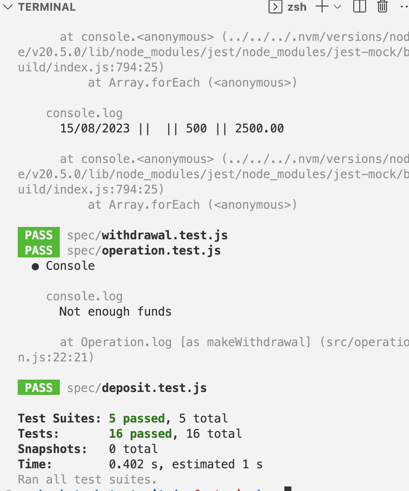

### Requirements

* You should be able to interact with your code via a REPL like IRB or Node.  (You don't need to implement a command line interface that takes input from STDIN.)
* Deposits, withdrawal.
* Account statement (date, amount, balance) printing.
* Data can be kept in memory (it doesn't need to be stored to a database or anything).

### Acceptance criteria

**Given** a client makes a deposit of 1000 on 10-01-2023  
**And** a deposit of 2000 on 13-01-2023  
**And** client makes a withdrawal of 500 on 14-01-2023  
**When** she prints her bank statement  
**Then** she would see

```
date || credit || debit || balance
14/01/2023 || || 500.00 || 2500.00
13/01/2023 || 2000.00 || || 3000.00
10/01/2023 || 1000.00 || || 1000.00
```
# Design recipe

### Planning
```
The goal was to create a versatile program with a clear structure to accommodate future enhancements easily.

I began by considering the actions users need to perform and how to implement them efficiently:

verbs: make deposit, make withdrawal, print statement.

nouns: date, amount, balance, transactions.


```
### User Functionality
The program should enable users to:
* Add funds to their account (make deposits).
* Withdraw funds from their account (make withdrawals).
* View their transaction history (print statements).

### Transaction Handling
When users make deposits or withdrawals:
* It updates their account balance.
* Records the transaction with the amount, date, and current balance.

### Essential Functions
To test this functionality, we require additional functions:
* A function to retrieve the current balance.
* *A function to retrieve a list of transactions.

In addition, we need to implement checks to ensure that there are sufficient funds in the account before a withdrawal is allowed.

### Modular Design:

To adhere to the Single Responsibility Principle, I've isolated different aspects of functionality into separate classes:


* Deposit and Withdrawal Classes: These allow users to set the amount and date for each transaction. They provide two methods: getAmount() and getDate(). This encapsulation simplifies the implementation of new transaction types and facilitates testing.

* Operation Class: This class handles deposits and withdrawals, ensuring proper recording in the Account class.

* Account Class: This class manages user account data, including balance and transaction history. It provides methods to check the current balance (checkBalance()) and retrieve transaction details (checkTransactions()).

* Statement Class: Separated from the others, this class utilizes data from the Account class to print a statement of all transactions, ordered from newest to oldest.

### Testing Strategy:
Each class has its own test files. Deposit and Withdrawal classes have unit tests, while Operation, Account, and Statement classes work together in integration tests using mocks.
```
### Extra things that can be implemented:
* credit limit option, so user can withdraw funds within the credit limit;
* interest on credit and debit rate.

### How to install and use the app
The app can be cloned from github and initialising in terminal with the code below:

```bash
git clone http://github.com/deniam24/bank_tech_test/ name_of_directory
```
You need to have NVM installed and setup environment.

After cloning the app make sure you are in the app directory. Then use terminal to install environment and jest to run tests:

```bash
# Initialise the NPM project (this will create a file package.json)
$ npm init -y

# Add the jest package to our project
# (this will update package.json and package-lock.json)
$ npm add jest

# Also install jest "globally"
# (this is so we can run the `jest` command)
$ npm install -g jest

# Run our tests
$ jest
```

You can run the app in the terminal by the command below:
```bash
$ node bankAccount.js
```

You can run the tests by typing `jest` in terminal.

