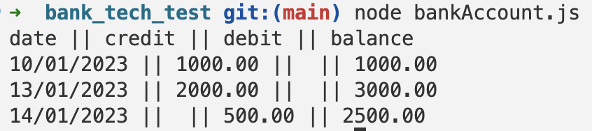

### Requirements

* You should be able to interact with your code via a REPL like IRB or Node.  (You don't need to implement a command line interface that takes input from STDIN.)
* Deposits, withdrawal.
* Account statement (date, amount, balance) printing.
* Data can be kept in memory (it doesn't need to be stored to a database or anything).

### Acceptance criteria

**Given** a client makes a deposit of 1000 on 10-01-2023  
**And** a deposit of 2000 on 13-01-2023  
**And** client makes a withdrawal of 500 on 14-01-2023  
**When** she prints her bank statement  
**Then** she would see

```
date || credit || debit || balance
14/01/2023 || || 500.00 || 2500.00
13/01/2023 || 2000.00 || || 3000.00
10/01/2023 || 1000.00 || || 1000.00
```
# Design recipe

### Planning

Idea is to create a single class program with functions so it should be easy to use it and it can be a base for adding advanced functionality in the future.

I tried to think as a user, what functionality do I need to have and then what steps do I need to do as a developer to implement it.
```
verbs: make deposit, make withdrawal, print statement.

nouns: date, amount, balance, transactions.
```
### Client should: 
 - add funds;
 - withdraw funds;
 - print statement.

### When the client add funds or make a withdraw:
 - it reflects on the amount of balance;
 - it records to the transaction with amount, date and current balance.

### To test this functionality, we need additional functions:
 - function that return current balance;
 - fubction that return a list of transactions.

* In addition, we need to check is there enough funds on the balance before withdraw and restrict it if the amount on the balance lower than amount of withdraw.
```
Class name: BankAccount
    constructor:
        - transactions
        - balance
    Functions: 
        - checkBalance
        - makeDeposit
        - makeWithdraw
        - checkTransactions
        - printStatement.
```
### Extra things that can be implemented:
* credit limit option, so user can withdraw funds within the credit limit;
* interest on credit and debit rate.

### How to install and use the app
The app can be cloned from github and initialising in terminal with the code below:

```bash
git clone http://github.com/deniam24/bank_tech_test/ name_of_directory
```
You need to have NVM installed and setup environment.

After cloning the app make sure you are in the app directory. Then use terminal to install environment and jest to run tests:

```bash
# Initialise the NPM project (this will create a file package.json)
$ npm init -y

# Add the jest package to our project
# (this will update package.json and package-lock.json)
$ npm add jest

# Also install jest "globally"
# (this is so we can run the `jest` command)
$ npm install -g jest

# Run our tests
$ jest
```

You can run the app in the terminal by the command below:
```bash
$ node bankAccount.js
```

You can run the tests by typing `jest` in terminal.

